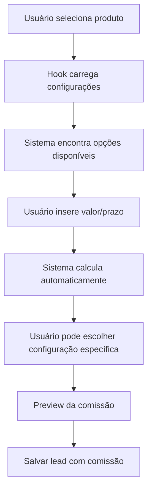

# 🚀 SISTEMA DE COMISSÕES INTEGRADO - LEADCONSIG CRM

## 🎯 **NOVA FUNCIONALIDADE IMPLEMENTADA**

O sistema agora integra **automaticamente** as configurações de comissão com os formulários de lead, permitindo:

- ✅ **Seleção dinâmica** de faixas de comissão baseada no produto
- ✅ **Cálculo automático** em tempo real conforme valor e prazo
- ✅ **Escolha específica** de configurações por produto (FGTS, CLT, etc.)
- ✅ **Preview da comissão** antes de salvar o lead
- ✅ **Integração completa** entre configurações e formulários

---

## 🏗️ **ARQUITETURA DO SISTEMA**

### **1. Hook Personalizado (`useCommissionConfig`)**
```typescript
const { 
  availableOptions,     // Opções de comissão para o produto
  selectedOption,       // Opção atualmente selecionada
  calculateCommission,  // Função para cálcular comissão
  findBestOption        // Encontra automaticamente a melhor opção
} = useCommissionConfig(productName);
```

### **2. Componente Inteligente (`CommissionConfigSelector`)**
- Detecta mudanças no produto, valor e prazo
- Carrega configurações específicas do produto
- Calcula comissão automaticamente
- Apresenta opções de forma intuitiva

### **3. Integração nos Formulários**
- **LeadForm**: Formulário de criação/edição
- **LeadCard**: Dialog de edição de leads
- **Cálculo em tempo real** conforme usuário digita

---

## 📝 **COMO USAR O SISTEMA**

### **Passo 1: Configurar Comissões**
1. Vá em **Comissões → Configurar Comissões**
2. Configure **Comissões Fixas** ou **Comissões Variáveis**
3. Defina produtos, faixas de valor/prazo e percentuais

### **Passo 2: Criar/Editar Leads**
1. No formulário de lead, selecione o **Produto**
2. O sistema **carrega automaticamente** as configurações
3. Insira o **Valor** e **Prazo de Pagamento**
4. O sistema **calcula automaticamente** a comissão
5. **Escolha a configuração** específica se houver múltiplas opções

### **Passo 3: Visualizar Comissão**
- **Preview em tempo real** da comissão calculada
- **Resumo no final** do formulário
- **Indicação no botão** de salvar quando há comissão

---

## 🎮 **TIPOS DE CONFIGURAÇÃO SUPORTADOS**

### **1. Taxa Fixa (commission_rates)**
- **Percentual fixo**: Ex: INSS sempre 3%
- **Valor fixo**: Ex: PIX/Cartão sempre R$ 50

### **2. Faixas por Valor (commission_tiers - value)**
- **FGTS por faixas**: 
  - Até R$ 500 = 15%
  - R$ 501-1000 = 12%
  - Acima R$ 1000 = 10%

### **3. Faixas por Prazo (commission_tiers - period)**
- **CLT por parcelas**:
  - 6x-12x = 1.5%
  - 13x-24x = 2.0%
  - 25x-36x = 2.5%

---

## 🔧 **EXEMPLOS PRÁTICOS**

### **Exemplo 1: FGTS com Múltiplas Faixas**
```
Produto: SAQUE ANIVERSARIO
Valor: R$ 800,00

Sistema mostra:
┌─────────────────────────────────────┐
│ 💰 Faixa Intermediária (R$ 501-1000) │
│ 📊 12% • R$ 96,00                   │
└─────────────────────────────────────┘
```

### **Exemplo 2: CLT com Escolha de Prazo**
```
Produto: EMPRESTIMO CONSIGNADO
Valor: R$ 5.000,00
Prazo: 18 parcelas

Sistema mostra:
┌─────────────────────────────────────┐
│ 📅 Prazo Médio (13x a 24x)          │
│ 📊 2.0% • R$ 100,00                │
└─────────────────────────────────────┘
```

### **Exemplo 3: PIX com Valor Fixo**
```
Produto: CARTAO CONSIGNADO
Valor: Qualquer

Sistema mostra:
┌─────────────────────────────────────┐
│ 🎯 Valor Fixo PIX/Cartão            │
│ 💰 R$ 50,00                        │
└─────────────────────────────────────┘
```

---

## ⚙️ **MAPEAMENTO DE PRODUTOS**

O sistema mapeia automaticamente produtos dos leads para configurações:

| **Produto no Lead** | **Mapeamento** | **Tipo de Configuração** |
|---|---|---|
| SAQUE ANIVERSARIO | CREDITO FGTS | Faixas por valor |
| EMPRESTIMO CONSIGNADO | CREDITO CLT | Faixas por prazo |
| novo | CREDITO INSS | Taxa fixa percentual |
| CARTAO CONSIGNADO | CREDITO PIX/CARTAO | Taxa fixa valor |
| portabilidade | PORTABILIDADE INSS | Faixas mistas |

---

## 🎛️ **INTERFACE DO USUÁRIO**

### **Seletor de Configuração**
```
┌─────────────────────────────────────────────────┐
│ 🧮 Configuração de Comissão                     │
│                                                 │
│ Configuração de Comissão ▼                     │
│ ┌─────────────────────────────────────────────┐ │
│ │ Faixa Intermediária (R$ 501 - R$ 1.000)    │ │
│ │ 💰 R$ 501,00 - R$ 1.000,00 • 📊 12%       │ │
│ └─────────────────────────────────────────────┘ │
│                                                 │
│ ✅ Comissão Calculada                          │
│ Valor da operação: R$ 800,00                   │
│ Percentual: 12.00%                             │
│ Comissão: R$ 96,00                            │
└─────────────────────────────────────────────────┘
```

### **Resumo no Formulário**
```
┌─────────────────────────────────────────────────┐
│ 💰 Comissão calculada: R$ 96,00 (12.00%)       │
└─────────────────────────────────────────────────┘

[Cancelar] [Salvar Lead (Com comissão)]
```

---

## 🧪 **COMO TESTAR**

### **1. Execute as Configurações de Exemplo**
```sql
-- Execute o arquivo: exemplo-configuracoes-comissao.sql
-- no SQL Editor do Supabase
```

### **2. Teste Diferentes Cenários**
- **FGTS R$ 300**: Deve mostrar faixa básica (15%)
- **FGTS R$ 800**: Deve mostrar faixa intermediária (12%)
- **FGTS R$ 1.500**: Deve mostrar faixa premium (10%)
- **CLT 10x**: Deve mostrar prazo curto (1.5%)
- **CLT 20x**: Deve mostrar prazo médio (2.0%)
- **PIX qualquer valor**: Deve mostrar valor fixo (R$ 50)

### **3. Verificar Cálculos**
- Mude valores e veja cálculo em tempo real
- Troque prazos e veja mudança de faixa
- Teste produtos sem configuração (deve mostrar alerta)

---

## 🔄 **FLUXO DE INTEGRAÇÃO**



---

## 🚀 **PRÓXIMOS PASSOS IMPLEMENTADOS**

✅ **Hook personalizado** para gerenciar configurações  
✅ **Componente inteligente** de seleção  
✅ **Integração no LeadForm** (criação)  
✅ **Integração no LeadCard** (edição)  
✅ **Cálculo automático** em tempo real  
✅ **Seleção dinâmica** de faixas  
✅ **Preview da comissão** antes de salvar  
✅ **Exemplos práticos** para teste  

---

## 💡 **BENEFÍCIOS DO SISTEMA**

- **🎯 Automatização**: Não precisa mais calcular manualmente
- **🔍 Transparência**: Usuário vê exatamente qual regra se aplica
- **⚡ Agilidade**: Cálculo instantâneo conforme digitação
- **🎮 Flexibilidade**: Permite escolher entre múltiplas configurações
- **📊 Precisão**: Elimina erros de cálculo manual
- **🔄 Integração**: Sistema totalmente integrado entre configuração e uso

---

## 🎉 **SISTEMA PRONTO PARA USO!**

O sistema de comissões agora está **totalmente integrado** aos formulários de lead, proporcionando uma experiência **fluida e automática** para configurar e calcular comissões baseadas em produtos, valores e prazos específicos. 